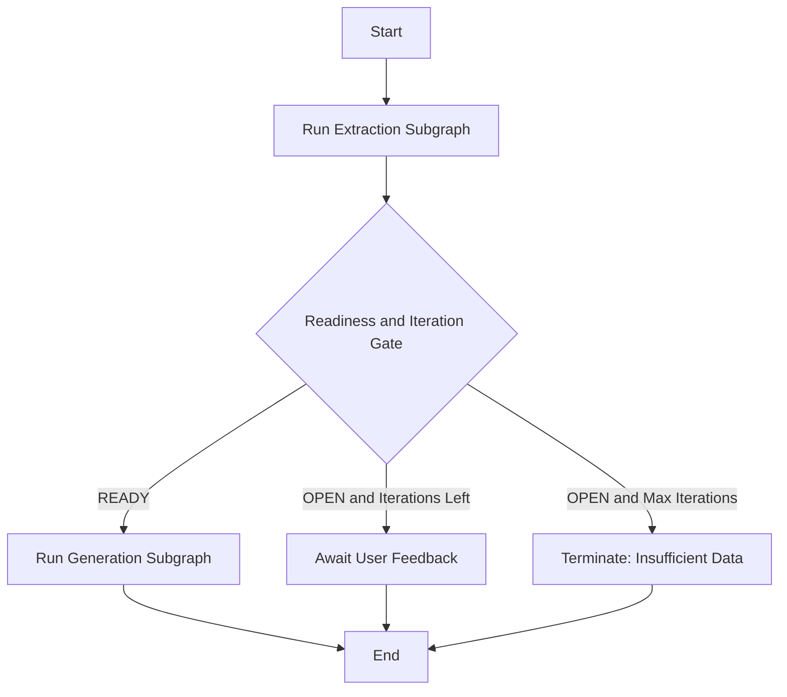
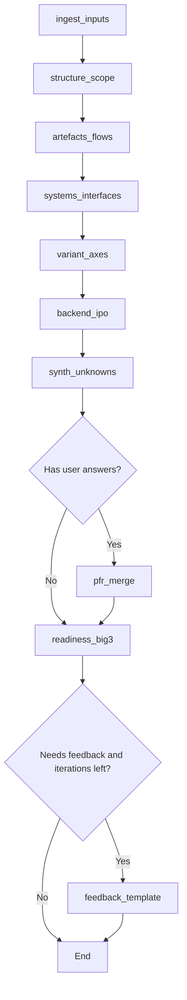
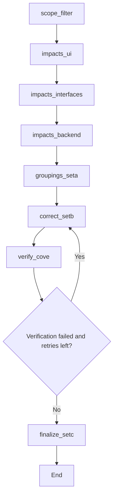

# DESIGN — GROSS Estimation Workflow 
 
## 1) Design Goals
 
This system is designed to:
- convert unstructured requirement inputs into structured requirement data (truth pack)
- avoid estimation on incomplete requirements by using readiness gating and feedback loops
- produce structured effort groupings with correction and verification
- keep the workflow explainable via state/events/logging
 
This aligns to the workflow specification: extraction layer → readiness assessment → feedback loop (max iterations) → generation layer → correction/verification → final output.
---
 
## 2) Core Architecture (3 graphs)
 
The workflow is split into:
 
1) Main graph (orchestrator)
- calls extraction
- routes based on readiness + iteration
- calls generation if READY
- terminates if max iterations reached while still OPEN
 
2) Extraction subgraph
- decomposes requirements into structured elements
- registers unknowns
- computes readiness
- produces feedback template when OPEN
 
3) Generation subgraph
- builds impact list from truth pack
- produces Set A → Set B → verification → Set C
- loops correction if verification fails (bounded by max attempts)
 
---
 
## 3) Shared State Model (GrossState)
 
Everything passes through a single mutable state dict (GrossState), including:
 
- inputs
- truth_pack
- readiness
- feedback_template_md / feedback_questions
- user_answers_raw / pfr
- generation_scope
- ui_impacts / interface_impacts / backend_impacts
- set_a / set_b / verification / effort_final
- iteration controls: iteration/max_iterations
- verification controls: verification_attempts/max_verification_attempts
- events/errors logs
 
The workflow spec explicitly depends on iteration controls (max feedback iterations) and generation verification loops.
 
---
 
## 4) Routing Logic 
 
### 4.1 Main routing (graphs/main/routing.py)
 
After extraction, route to one of:
- generation (if READY)
- await user (if OPEN and iterations remain)
- terminate (if OPEN and max iterations reached)
 
This corresponds to the “Any FCU = OPEN?” + “Iteration <= Max (3)?” gates in the workflow spec. 
 
### 4.2 Extraction routing (graphs/extraction/routing.py)
 
- After synth_unknowns:
  - if user_answers_raw exists → pfr_merge
  - else → readiness_big3
 
- After readiness_big3:
  - if OPEN and iterations remain → feedback_template
  - else → end extraction
 
This matches the feedback loop design and PFR usage described in the extraction prompt.
 
### 4.3 Generation routing (graphs/generation/routing.py)
 
- After verify_cove:
  - if FAIL and retries remain → correct_setb
  - else → finalize_setc
 
This matches the PASS/FAIL regeneration loop described in the workflow spec. 
 
---
 
## 5) Graph diagrams (Mermaid)
 
### 5.1 Main graph (Orchestrator)
 

 
### 5.2 Extraction Subgraph
 

 
### 5.3 Generation Subgraph
 

 
---
 
## 6) Node Responsibilities
 
### 6.1 Extraction Nodes
 
Extraction follows the pipeline described in your workflow spec:
- structure/scope
- artefacts/flows
- systems/interfaces
- variant axes
- backend I/P/O
- synthesis + unknowns
- readiness
- feedback (gap list + PFR update) 
 
Nodes:
 
- ingest_inputs
  - validates inputs exist
  - initializes iteration counters
  - sets phase = EXTRACTION
 
- structure_scope
  - identifies DM context, functionalities, FCUs
  - produces FCU registry with slide references
 
- artefacts_flows
  - extracts UI artefacts and flow steps
 
- systems_interfaces
  - extracts named systems, interface entries, and purposes
 
- variant_axes
  - extracts variation axes and divergence types
 
- backend_ipo
  - extracts backend capabilities using Input/Process/Output black-box form
 
- synth_unknowns
  - consolidates extraction outputs into a unified truth pack
  - registers unknowns explicitly
 
- pfr_merge
  - parses user answers and stores them into PFR
  - applies answers to unknowns where possible
 
- readiness_big3
  - sets READY/OPEN based on blocking unknowns
 
- feedback_template
  - generates bounded clarification questions for OPEN gaps
 
---
 
### 6.2 Generation Nodes
 
Generation follows the pipeline described in your workflow spec:
- scope filter
- impact analysis (UI, interface, backend)
- Set A
- correction (Set B)
- verification (CoVE)
- final Set C 
 
Nodes:
 
- scope_filter
  - selects relevant FCUs/artefacts/interfaces/backend capabilities for this functionality
 
- impacts_ui / impacts_interfaces / impacts_backend
  - turns extracted slice into “work impacts” used for estimation
 
- groupings_seta
  - generates Set A initial effort groupings
 
- correct_setb
  - consolidates and corrects Set A into Set B
  - increments verification_attempts to avoid infinite loops
 
- verify_cove
  - verifies Set B and outputs PASS/FAIL + audits
 
- finalize_setc
  - outputs final effort_final and sets phase = DONE
 
---
 
## 7) Memory Design (Mem0)
 
### 7.1 Why memory exists
 
Your workflow includes memory blocks for:
- team contextual memory (canonical system names, acronyms, conventions)
- glossary (worktype and complexity rubric)
- historical CR patterns (sanity checking / ambiguity detection, not direct estimation) 
 
### 7.2 Mem0 partitions used
 
This repo uses three Mem0 partitions (implemented via filters on user_id):
 
- team_context
- worktype_glossary
- historical_cr
 
Seed documents live in:
 
    data/memory_seed/
 
Bootstrap scripts load them into Mem0.
 
### 7.3 Where memory is injected
 
Memory retrieval is embedded inside selected nodes:
- systems_interfaces: team_context for system name normalization
- groupings_seta: glossary for worktype/complexity consistency
- verify_cove: historical patterns for sanity checks
 
Mem0 is configured explicitly using Memory.from_config so that model selection is deterministic (no default model surprises), following Mem0 config precedence rules.
 
---
 
## 8) Execution entrypoints
 
This repo is scripts-driven (no cli/ folder). The primary entrypoints are:
 
- scripts/run_demo.py
  - runs end-to-end workflow
  - prints a clean final estimate output
 
- scripts/memory_bootstrap_mem0.py
  - loads seed memory docs into Mem0
 
- scripts/memory_test_mem0.py
  - checks retrieval outputs
 
---
 
## 9) Test strategy (high-level)
 
Tests are structured in layers:
 
- Node tests
  - each node executes with mocked LLM calls to avoid API usage
 
- Graph tests
  - extraction subgraph runs end-to-end
  - generation subgraph runs end-to-end
  - main graph routes correctly (READY vs AWAITING_USER vs terminate)
 
This ensures workflow stability even as prompts evolve.